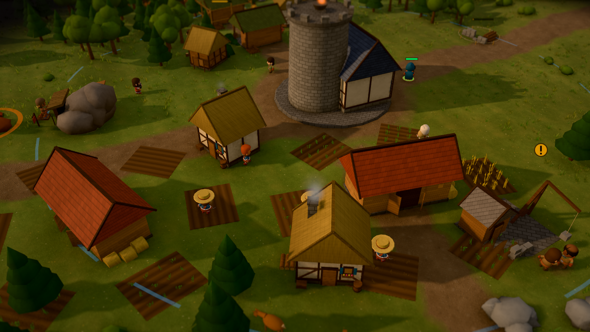
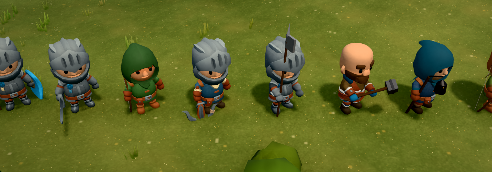

# Kindlehold

**A 3D settlement-building and real-time strategy game for the browser** — six story chapters,
a free-play mode on four maps plus endless random maps, four enemy factions, and a living economy of settlers who fell
trees, farm, fish, mine, cook and carry. Written in plain JavaScript on Three.js, no game engine.

**Play it:** <https://kindlehold.js-automata.work> (desktop browser with WebGL 2)



| | |
|---|---|
|  |  |

## What is in it

- **Economy in the spirit of the classic settler games:** woodcutters, quarries, farms, mines,
  fishers, hunters, salt works and taverns; production chains (windmill → flour → bakery →
  bread, iron → smithy → tools for the third workshop level); settlers haul goods, sleep at
  night, eat, grow content or restless; seasons with snow, a freezing river and slow winter fields.
- **Campaign:** six chapters with an original story, spoken intros over camera flights, allies
  and choices that carry over (win the Greyfen brigands as friends or destroy their hold).
- **Free play:** any of the four maps against the faction that holds it, or **the Wildlands** —
  a random valley generated from the game's seed (hills, lakes, forests, a river with fords)
  against a lord drawn by lot.
- **Battles:** nine soldier types with counters, veterans with ranks, towers, sieges of stone
  walls, heroes with abilities (Maren's lantern, Wren's arrow storm).
- **Four enemy factions** with their own units, buildings and AI behaviour.
- **Presentation:** HDR post-processing (tone mapping, bloom, ambient occlusion, miniature
  focus), day and night, cloud shadows, procedural terrain, water and weather; modelled,
  skinned characters with 37 animations; procedural music and sound.
- **Robust on weak machines:** a load governor switches effects off before it lowers the
  resolution, a 30 fps limit, and an in-game diagnostics log (F3).

## How it was made

Kindlehold was built by me together with **Claude Code** (Anthropic's AI coding agent) —
"vibe-coded", but with a strict process: I set the direction and priorities, played every
build, reported what felt wrong (sliding feet, oddly held tools, hitches on my laptop), decided
on trade-offs such as the character art, and ran the server. The agent wrote the code, tests and
tooling, measured instead of guessing, and documented every step for the next session
([HANDOFF.md](HANDOFF.md)). Every commit made with the agent says so (`Co-Authored-By: Claude`).

What that process looks like in the repository:

- **149 automated tests** (`node:test`): unit, integration and *deterministic simulation* tests
  that replay whole chapters with a scripted bot.
- **17 end-to-end tests** in a real browser (Playwright): menus, tutorial, save/load round trip,
  every campaign chapter, graphics driver reset, layout at 1280×720.
- **Soak and leak tests** that play for many game minutes and watch GPU buffers, textures,
  shaders, DOM and heap.
- **Visual verification**: screenshot presets across times of day and zoom levels.
- **Continuous integration** on every push (GitHub Actions).
- **Deployment** to my own server (nginx behind a Cloudflare tunnel, atomic releases with rollback).

## Architecture at a glance

```
simulation (20 Hz, deterministic, no rendering)      view (every frame, reads the world only)
  world state ── economy, population, combat, AI,      terrain, buildings, figures (instanced,
  missions, construction, weather                      GPU-skinned), effects, sky, water, HUD
        │                                                         ▲
        └──── events on a bus ───────────────────────────────────┘
```

- One plain `world` object holds everything that matters; saving is serialising it (with a
  strict schema and migrations), loading replaces it. A seeded RNG lives inside the world, so
  the same seed and commands always give the same game — which is what makes the simulation
  tests possible.
- Modules run behind error boundaries: a failing view module is switched off, a failing core
  module shows a recoverable error screen instead of a dead page.
- Content is declarative: chapters, objectives, story beats and enemy setups are data
  (`src/missions/scenarios/`).

More: [docs/ARCHITECTURE_OVERVIEW.md](docs/ARCHITECTURE_OVERVIEW.md) (a short tour) ·
[ARCHITECTURE.md](ARCHITECTURE.md) (module contracts) · [GAME_DESIGN.md](GAME_DESIGN.md) ·
[docs/SIEDLER_ROADMAP.md](docs/SIEDLER_ROADMAP.md) (roadmap, German).

## Run it locally

```bash
npm ci                 # Node 20+
npm run dev            # http://127.0.0.1:5180/
npm test               # the 149 tests
npm run build && npm run preview
npm run test:e2e       # browser tests (needs: npx playwright install chromium)
```

Useful addresses: `?showcase=figures&group=army&anim=attack` (character studio),
`?showcase=<terrain|environment|buildings|economy|units|combat|effects|audio|ui>` (isolated
scenes), `?figs=classic` (the earlier procedural figures), `?post=off` (no post-processing).

## Controls

| Action | Input |
|---|---|
| Select | Left-click · drag a box · Shift adds · double-click selects the same type |
| Move / attack | Right-click |
| Camera | Right-drag the map · arrow keys · Q/E or middle-drag to rotate · wheel to zoom |
| Hero abilities | F · G |
| Build menu · centre selection · centre Keep | B · Space · Home |
| Game speed · pause | [ / ] · Esc |
| Quick save · quick load · diagnostics | F5 · F9 · F3 |

The full guide is in the game (*How to Play*) and in [docs/PLAYER_GUIDE.md](docs/PLAYER_GUIDE.md).

## Credits

Game design, story, code, terrain, music and sound are original to this project,
most of it generated procedurally at runtime. Characters and their animations: **KayKit
Adventurers Character Pack** by Kay Lousberg (CC0), recoloured and dressed for Kindlehold's
roles. Building models and props: **KayKit Medieval Hexagon Pack** by Kay Lousberg (CC0).
Rendering: three.js (MIT). Every external file is listed in
[ASSET_REGISTER.md](ASSET_REGISTER.md).

Kindlehold is an original game, inspired only by the general conventions of economy-focused
strategy games; it is not affiliated with or a remake of any existing game.
