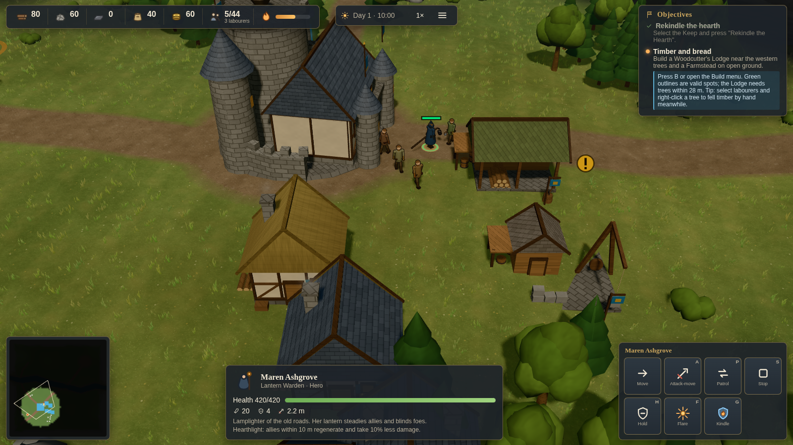

# Kindlehold und „Die Siedler – Das Erbe der Könige“: Stufen-Roadmap

Das Ziel des Nutzers: so nah wie möglich an das Spielgefühl von *Die Siedler – Das Erbe der
Könige* (2004) heranzukommen, ohne das Spiel zu kopieren. Namen, Story, Grafik, Musik und
Zahlen bleiben eigene Arbeit (siehe `ASSET_REGISTER.md`). Übernommen werden nur
Genre-Ideen. Diese Datei ordnet den Stand in drei Stufen ein.

| Stufe | Bedeutung |
|---|---|
| 1 | Spielbarer Prototyp: Wirtschaft, Bauen, Kampf, ein Held, eine Mission (Stand 2026-09-24) |
| 2 | Erkennbares „Siedler-Gefühl“: Jahreszeiten, Erkundung, direkte Befehle, Porträts, Taler |
| 2.5 | Lebendiges Tal: Ausbaustufen, Tagesablauf, Nahrungskette, Wild, Entdeckungen, bessere Figuren |
| 3 | Nah am Vorbild: volle Wirtschaft mit Geld, Gebäudestufen, mehrere Helden und Karten, Kampagne |

## Stufe 2: umgesetzt (Session vom 2026-09-26)

| Merkmal im Vorbild | Umsetzung in Kindlehold | Code |
|---|---|---|
| Wetter und Winter: Schnee, zugefrorene Gewässer als neue Wege | Fester Zyklus aus 8 min Sommer und 3 min Winter, der erste Winter beginnt bei Minute 17. Schnee auf Boden, Dächern, Bäumen und Felsen, Schneefall, kühleres Licht. Der Fluss friert zu und ist dann überall begehbar, auch für die Rustfang. Vor dem Tauwetter kommt eine Warnung, wer dann noch auf dem Eis steht, wird nass und verletzt. Felder wachsen im Winter nur mit 50 %. | `src/weather/`, `src/environment/winter.js`, Shader in `terrain-view.js`, `water.js`, `structure-material.js` |
| Leibeigene, die man direkt zum Holzfällen oder Steinhauen schickt | Arbeiter anwählen, dann Rechtsklick auf Baum oder Felsen: Sie sammeln von Hand und tragen die Ware zur Burg. „Back to work“ schickt sie zurück an die normale Arbeit. | `src/economy/index.js` (`gather`/`release`), `src/input/index.js`, HUD |
| Unerkundete Karte liegt im Dunkeln | Das erkundete Gebiet wird als Bitmaske gespeichert. Unerkundetes Land ist dunkel, die Minimap zeigt nur Erkundetes. | `src/exploration/`, `src/environment/shroud.js`, `src/ui/minimap.js` |
| Missionsdialoge mit Porträts | Eigene SVG-Porträts für Maren, Osric, Wren und Vharek im Dialogfenster. Neue Sprechzeilen zu Winter und Eis. | `src/ui/portraits.js`, `src/ui/hud.js` |
| Taler, Steuern, Zahltag, Leibeigene kaufen | Alle 2 min ist Zahltag: Siedler zahlen Steuern, Soldaten bekommen Sold. Der Steuersatz an der Burg (niedrig, fair, hoch) wirkt auf die Stabilität. Für 40 Taler lässt sich an der Burg sofort ein Arbeiter anwerben. | `src/population/index.js`, HUD, Speicherstand-Schema 3 |
| Jahreszeit sichtbar | Die Uhr zeigt Sommer, Winter und einen Countdown. Die Minimap wird im Winter weiß. | `src/ui/hud.js`, `src/ui/minimap.js` |

Belegbilder: `docs/screenshots/evidence/level2-*.png`.

## Stufe 2.5: umgesetzt (Session vom 2026-09-26, zweiter Teil)

Grundlage war die Wunschliste des Nutzers nach dem ersten Anspielen.

| Wunsch | Umsetzung | Code |
|---|---|---|
| Bauplatz wird schnell zu klein | Die Burg wird in zwei Stufen ausgebaut: Castle (+14 m Gebiet, +4 Wohnraum, +25 % Steuern) und Fortress (+12 m, braucht die March Charter). Beide sind sichtbar mit Ringmauer, Türmen und Torhaus. | `UPGRADES` in `src/buildings/defs.js`, `src/construction/index.js`, `src/buildings/meshes.js` |
| Eisen schlecht zu finden | Rostrote Erzader mit Erzbrocken, ein Ring auf dem Boden, ein deutlicher Punkt auf der Minimap. Beim Platzieren von Mine oder Steinbruch pulsieren alle passenden Vorkommen. | `src/environment/vegetation.js`, `src/selection/view.js`, `src/ui/minimap.js` |
| Schönere Avatare | Variante A: Knie und Ellbogen, Gesichter (Augen, Brauen, Nase, Mund, Ohren), Haarfarben, Bärte, Röcke, Hüftschwung und Kopfnicken. Variante B (Skelett-Animation mit echten Modellen) bleibt für Stufe 3. | `src/units/figures.js` |
| Ausbaustufen für Gebäude und Truppen | Cottage → Stone House → Townhouse (+3/+3 Wohnraum), Betriebe auf Stufe 2 (+1 Arbeiter, +20 % Tempo). Neue Forschungen für Truppen: Steel Mail (+20 % Leben, +2 Rüstung) und Veteran Drill (+15 % Angriffstempo, +10 % Marsch, braucht das Castle). | wie oben, `src/technology/defs.js`, `src/combat/index.js`, `src/units/sim.js` |
| Arbeiter schlafen nachts | Siedler gehen ab 22 Uhr gestaffelt in das nächste Haus und kommen ab 5 Uhr wieder heraus. Schlafende sind sicher und essen nicht. Die Nacht vergeht doppelt so schnell, ausgeruhte Siedler arbeiten tagsüber 18 % schneller. Die Kaserne weckt Freiwillige für die Ausbildung. | `src/population/daily.js`, `src/app/simulation.js` |
| Etwas zu entdecken | Händler am Wegkreuz (Handel mit Taler), Aussichts-Steinmann (deckt 70 m auf), alte Wachruine jenseits des Flusses (Schatz), Weiler Millbrook (Verbündeter, wenn Maren ihn besucht: Familien und ein Tribut an jedem Zahltag). Beim Entdecken gibt es Dialoge mit Porträts. | `src/pois/`, `src/environment/pois-view.js` |
| Tiere, Jagd, Verarbeitung | Hirschrudel mit Weiden, Flucht und Nachwuchs. Die Jägerhütte liefert Fleisch, auch im Winter. Die Taverne verarbeitet 2 Proviant zu 3 warmen Mahlzeiten, die zuerst ausgegeben werden und die Stimmung heben. | `src/wildlife/`, `src/environment/wildlife-view.js`, `src/production/index.js` |
| Uhrzeit passt nicht zur Helligkeit | Die Uhr zeigte zuerst die gespielte Zeit. Jetzt steht dort „Day 2 · 10:30“, die Spielzeit steht im Tooltip. | `src/ui/hud.js` |
| Grenze im Winter unsichtbar | Die Gebietsgrenze wird bei Schnee dunkler und kräftiger. | `src/selection/view.js` |

Prüfung: 91 Tests, e2e 10/10, alle 14 Screenshot-Presets bestanden. Zwei Presets lagen zunächst
knapp über dem Budget von 1,5 M Dreiecken, nach dem Verschlanken der Figuren liegt das Maximum bei
1,43 M. Belegbilder: `docs/screenshots/evidence/level25-*.png` (Festung und Ausbaustufen,
schlafendes Dorf bei Nacht, Figuren mit Hirschrudel).

Nebenbei gefunden und behoben: Ein Siedler auf dem Weg zur Kaserne konnte gleichzeitig einen
Arbeitsplatz bekommen und blieb dann für immer stehen. Die Kaserne bildete in solchen Fällen
keine Soldaten mehr aus.

Ebenfalls behoben: Die neue Taverne nahm der Eisenmine die Proviant-Lieferungen weg, eine leere
Mine wird jetzt zuerst beliefert. Der erste Winter kommt erst bei Minute 17 (nach dem ersten
Überfall), damit Winter, erste Nacht und Überfall nicht zusammenfallen.

**Balance (Test-Bot, `npm run balance`, 40-Minuten-Grenze):** 7 von 8 Partien gewonnen. Story
25,7 min, Normal 4 von 4 (22,8–37,8 min), Hard 2 von 3 (34,9 und 35,6 min, einmal nicht fertig).
Vor den Änderungen der Stufen 2 und 2.5 gewann der Bot Hard auf allen Seeds, Hard ist also
schwerer geworden. Menschliche Spieler haben mit Ausbaustufen, Handel und Leibeigenen mehr
Werkzeuge als der Bot, getestet ist das aber nicht.

## Stufe 3: was noch fehlt (ehrliche Liste, grob nach Wirkung sortiert)

1. **Echte animierte Figuren (Variante B):** Modelle mit Skelett, z. B. aus CC0-Paketen,
   mit Lauf-, Arbeits- und Kampfanimationen. Wegen der vielen Figuren sind dafür
   Leistungstricks nötig (Animation in Texturen vorberechnen, Detailstufen).
2. **Mehr Helden und eine Kampagne:** mehrere Karten, Zwischensequenzen mit Kamerafahrt,
   Sprachausgabe.
3. **Truppen als Trupps mit Hauptmann,** die man mit Taler nachkauft, dazu Belagerungswaffen.
4. **Längere Warenketten:** Mühle → Bäckerei, Schmiede für Werkzeuge, Fischer, Handelsrouten
   zwischen Siedlungen.
5. **Weiteres Wetter** (Regen mit Einfluss auf Felder und Wege) und echtes Sichtfeld im Nebel.
6. **Balance mit echten Spielern,** besonders auf Hard, und eine komponierte Musik.

## Hinweise zur Weiterarbeit

- Winter (`SEASON` in `src/weather/index.js`) und Nacht (`NIGHT` in `src/population/daily.js`)
  laufen fest nach Spielzeit ab, damit Speichern, Laden und Tests deterministisch bleiben.
- Schnee und Nebel laufen über gemeinsame Shader-Uniforms (`SNOW`, `SHROUD`) in
  `src/render/structure-material.js`. Neue Materialien sollten `patchStructureShader` benutzen
  (Overlays `shroudOverlay`), dann erhalten sie beides automatisch.
- Balance-Check: `npm run balance` lässt den Test-Bot 8 Partien über alle Schwierigkeiten spielen
  (etwa 1 Minute). Einzelne Läufe: `npm run balance -- hard:7 normal:42`.
